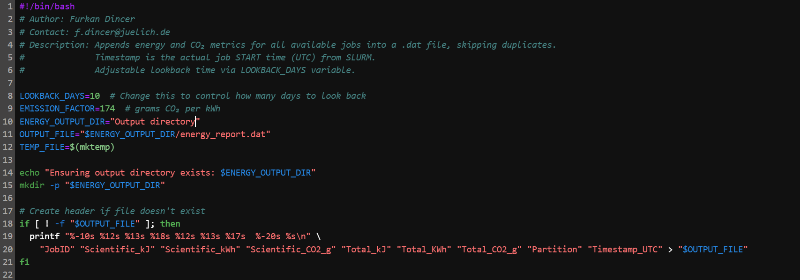
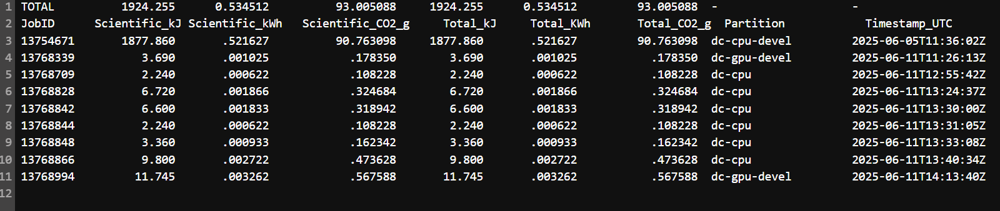

# CO2 emmision estimator 

Author: **Furkan Dincer**  
Contact: [f.dincer@juelich.de](mailto:f.dincer@juelich.de)  
Affiliation: Jülich Supercomputing Centre (JSC)

---

If you want to know how badly your computations are polluting and feel bad about it, you are in the right place!

## energy_co2_report_old.sh:

A Bash script to calculate the energy consumption and estimated CO₂ emissions of an HPC job on SLURM-managed systems (e.g., JURECA at JSC).  
It separates **scientific compute energy** from the **total job footprint**, enabling accurate sustainability metrics for research workloads.

---

## What It Does

This script retrieves job-level energy consumption from SLURM’s accounting system using `sacct`, and computes:

-  **Scientific Compute Energy** — from the main compute step (usually `.0`)
-  **Total Job Footprint Energy** — includes all setup, wrapper, and retry steps
-  **Estimated CO₂ emissions** — using a user-defined CO₂ per kWh factor (default: 175 g CO₂/kWh)

---

##  Requirements

- SLURM with energy accounting enabled
- The following SLURM tools must be available:
  - `sacct`
- Shell tools:
  - `grep`, `cut`, `bc`

Tested on: **JURECA (JSC)** both gpu and cpu!

---

##  Usage

Run the file wherever you want. The only important thing is the job ID.


```bash
./energy_co2_report.sh <SLURM_JOB_ID>


##  Example Output

--------------------ᓀ ᵥ ᓂ-----------------------
 Job ID:                        <SLURM_JOB_ID>

 ▶ Scientific Compute Step (.0)
   Energy:                       6291420 J
   Energy (kWh):                 1.747616 kWh
   CO₂ Emission (scientific):    830.117600 grams

 ▶ Total Job Footprint
   Energy:                       18596590 J
   Energy (kWh):                 5.165719 kWh
   CO₂ Emission (total):         2453.716525 grams
--------------------ᓀ ᵥ ᓂ-----------------------
```

## energy_co2_report.sh:

It does the same calculations as the old version. In addition, it gathers all the information about the jobs that were done in a given period.
It also writes all the results in a .dat file to a given directory.

## What does it do:
1. Scans SLURM Job History
Looks back over the last N days (default: 365 days).

Retrieves jobs with status: COMPLETED, FAILED, or TIMEOUT.

Skips duplicates — only appends data for jobs not already recorded in the output report.

  2️. Retrieves Energy Metrics
For each job:

-Gets energy used by the main compute step (scientific compute energy, from sub-steps).

-Gets total job energy (all steps combined).

3. Calculates and log:

  Scientific & total energy:
  
  - Kilojoules (kJ)
  
  - Kilowatt-hours (kWh)
  
  - Estimated CO₂ emissions (g), using configurable emission factor (default: 174 g/kWh).
  
  - Job partition
  
  - Job start time (UTC)
  
  Summarizes Totals At the top of the report:
  
  - Sum of scientific and total energy across all recorded jobs.
  
  - Sum of estimated CO₂ emissions.

## How to use it

You should designate the directory where you want to save the energy_report.dat file. 

And arrange the lookback time: They are the days that the code looks back. Initially, designated as 1 year.

The conversion factor is the sum of cooling and energy expenditures corresponding to the CO2 emission calculated for Julich's system. 
It is the average value of different systems' maximums. Therefore, it points to an upper limit for your emission values. 

The first part of the code is shown below. This is where you need to make the changes for the directory and the assumed conversion factor if you have numbers for your system



The example output is shown below. Sums are written on top. Timestamp shown when the job was run (start time).



##  Suggestions -LLview
To improve code efficiency, you can use LLview to monitor every single detail.

- Simple go to: [on the official JSC page](https://www.fz-juelich.de/en/ias/jsc/services/user-support/software-tools/llview?expand=translations,fzjsettings,nearest-institut)

- Select the JSC system you are using.

- Enter your JuDoor credentials.

- Click your name. Here you can see details information about jobs ended in the last 3 weeks.

- Red colour in usage means your code is not efficiently using the nodes. (You can see how red my codes are. Don't be me!)


- In case you are someone who is hungry for more knowledge, put your mouse on top of the microscopic sized graph symbol shown in the pic as Here!!. you can reach a detailed view of that specific job. You also have current power usage here.

- And the button right next to it downloads the job report. 

## ⚠️ General warning

The assumed CO2 conversion factor is the maximum of the average in the Juelich Supercomputer Centre (JSC) with cooling effect included. 

PS. If you will be using the Jupiter exascale cluster, good for you. All of its energy is provided by renewable sources. 


## Guidelines for scientists to reduce computational CO₂ production

1️⃣ Improve code performance

    Profile your codes (e.g., with roofline models, DIMEMAS, Vampir) to identify bottlenecks.

    Optimize for fewer data movements, improved cache usage, and minimal idling.

    Use high-performance numerical libraries tuned for your hardware (e.g., vendor BLAS, HDF5 for I/O).

2️⃣ Embrace modern hardware efficiently

    Port codes to GPU and other accelerators, especially for compute-intensive or massively parallel parts.

    Where possible, exploit low-precision arithmetic without compromising scientific accuracy.

3️⃣ Design for modularity and portability

    Separate hardware-specific code from scientific core logic to ease future adaptation.

    Use portable programming models (SYCL, Kokkos, OpenMP, etc.) to prepare for heterogeneous and future architectures.

4️⃣ Reduce and reuse data

    Apply FAIR principles: make simulation results findable, accessible, interoperable, reusable.

    Share simulation outputs and intermediate results to avoid duplicated runs.

5️⃣ Plan resource use carefully

    Activate only necessary physical processes and models for the scientific question at hand.

    Choose minimal necessary computational resources and monitor for high utilization during the run.

    Prioritize co-scheduling and efficient job packing when offered by HPC centers.

6️⃣ Benchmark and tune for energy

    Before large production runs, benchmark to find configurations with the best performance per Watt.

    Explore reducing operational frequency in memory-bound applications where it doesn’t increase runtime significantly.

7️⃣ Engage with HPC support and training

    Collaborate with HPC experts or Research Software Engineers (RSEs).

    Invest in training for your team on HPC performance analysis, energy-efficient programming, and modern languages.


