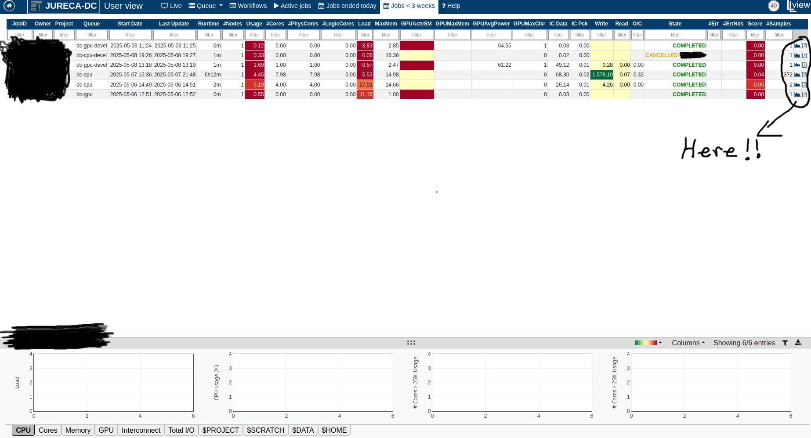

# CO2 emmision estimator 

Author: **Furkan Dincer**  
Contact: [f.dincer@juelich.de](mailto:f.dincer@juelich.de)  
Affiliation: Jülich Supercomputing Centre (JSC)

---

If you want to have an idea about how badly your computations are polluting and feel bad about it, you are in the right place!

## energy_co2_report.sh:

A Bash script to calculate the energy consumption and estimated CO₂ emissions of an HPC job on SLURM-managed systems (e.g., JURECA at JSC).  
It separates **scientific compute energy** from the **total job footprint**, enabling accurate sustainability metrics for research workloads.

---

## 🔍 What It Does

This script retrieves job-level energy consumption from SLURM’s accounting system using `sacct`, and computes:

- ⚡ **Scientific Compute Energy** — from the main compute step (usually `.0`)
- 🌍 **Total Job Footprint Energy** — includes all setup, wrapper, and retry steps
- ♻️ **Estimated CO₂ emissions** — using a user-defined CO₂ per kWh factor (default: 475 g CO₂/kWh)

---

## 📦 Requirements

- SLURM with energy accounting enabled
- The following SLURM tools must be available:
  - `sacct`
- Shell tools:
  - `grep`, `cut`, `bc`

Tested on: **JURECA (JSC)** both gpu and cpu!

---

## 🚀 Usage

Just copy the file where ever you want and run with the job ID in the system you want to check. Only important thing is the job ID.

And I do not consider cooling here. When I have information about it, I will add its effect. 

```bash
chmod +x energy_co2_report.sh
./energy_co2_report.sh <SLURM_JOB_ID>


## 📋 Example Output

--------------------ᓀ ᵥ ᓂ-----------------------
 Job ID:                         13657864

 ▶ Scientific Compute Step (.0)
   Energy:                       6291420 J
   Energy (kWh):                 1.747616 kWh
   CO₂ Emission (scientific):    830.117600 grams

 ▶ Total Job Footprint
   Energy:                       18596590 J
   Energy (kWh):                 5.165719 kWh
   CO₂ Emission (total):         2453.716525 grams
--------------------ᓀ ᵥ ᓂ-----------------------
```

## 🖥️ Suggestions -LLview
In order to improve code efficiency you can use LLview to monitor every single detail.

- Simple go to: [on the official JSC page](https://www.fz-juelich.de/en/ias/jsc/services/user-support/software-tools/llview?expand=translations,fzjsettings,nearest-institut)

- Select the JSC system you are using.

- Enter your JuDoor credentials.

- Click you name. Here you can see details information about jobs ended in the last 3 weeks.

- Red color in usage means your code is not efficiently using the nodes. (You can see how red my codes are. Don't be me!)



- In case you are someone who is hungry for more knowledge, put your mouse on top of the microscopic sized graph symbol shown in the pic as Here!!. you can reach a detailed view of that specific job. You also have current power usage here.

- And the button right next to it downloads the job report. 

## ⚠️ General warning

Assumed CO2 conversion factor is just the average of Germany! I am working on getting real numbers for Juelich.

PS. If you will be using Jupiter exascale cluster, good for you. All of its energy is provided by renewable. 


